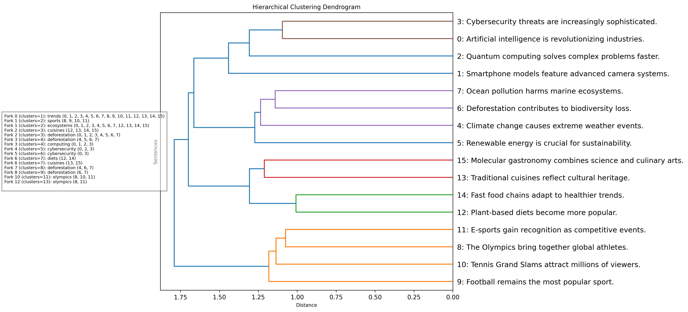

# Hierarchical Clustering of Sentences with Keyword Extraction

This project demonstrates how to perform hierarchical clustering on a set of sentences using sentence embeddings and visualize the results with a dendrogram. Additionally, it extracts semantically important keywords for each cluster to provide insights into the themes represented by the clusters. The final output includes a dendrogram image saved to a file, with keywords annotated at relevant forks, allowing for easy interpretation of the clusters.

## Overview

The code uses the `SentenceTransformer` library to generate embeddings for sentences and individual words. It then performs hierarchical clustering using these embeddings and visualizes the clusters with a dendrogram. For each cluster, the code identifies the most semantically relevant keywords by calculating the cosine similarity between the sentence embeddings and word embeddings. The dendrogram is annotated with these keywords to provide a clear understanding of the themes within each cluster, and it is saved as an image file.



## Features

- **Sentence Embeddings**: Converts sentences into dense vector representations using a pre-trained transformer model (`all-MiniLM-L6-v2`).
- **Hierarchical Clustering**: Groups sentences into clusters based on their semantic similarity using the Ward method.
- **Dendrogram Visualization**: Displays the hierarchical structure of the clusters in a tree-like diagram, with keywords annotated at each significant fork.
- **Keyword Extraction**: Identifies and prints semantically important keywords for each cluster.
- **Plot Saving**: Saves the dendrogram as an image file with annotated keywords for easy reference.

## Requirements

- Python 3.x
- `sentence-transformers`
- `scipy`
- `matplotlib`
- `numpy`
- `scikit-learn`

You can install the required packages using pip:
```
pip install sentence-transformers scipy matplotlib numpy scikit-learn
```

## Usage

1. **Define Sentences**: Modify the `sentences` list in the code to include the sentences you want to cluster.

2. **Run the Code**: Execute the script to generate the dendrogram and print the keywords for each cluster.

3. **View Results**: The dendrogram will be displayed in a window, and the console will show the keywords and sentences for each cluster.

## Code Summary

1. **Load Model**: The code loads a pre-trained sentence transformer model to generate embeddings.

2. **Generate Embeddings**: It creates embeddings for both the sentences and individual words in the sentences.

3. **Perform Clustering**: The code uses the `linkage` method from `scipy` to perform hierarchical clustering on the sentence embeddings.

4. **Visualize Dendrogram**: A dendrogram is plotted to visualize the hierarchical clustering of the sentences.

5. **Extract Keywords**: For each cluster, the code calculates the mean embedding and finds the top words with the highest cosine similarity to this embedding, identifying them as keywords.

6. **Print Results**: The keywords and corresponding sentences for each cluster are printed to the console.

## Example

The code includes an example set of sentences related to various topics such as technology, environment, sports, and culture. You can modify this list to explore different datasets.

## License

This project is open-source and available under the MIT License.